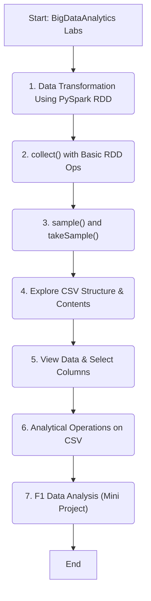

# Big Data Analytics with PySpark — Labs and F1 Mini Project

This repository contains a sequence of PySpark labs in Jupyter Notebooks, progressing from RDD fundamentals to a capstone-style mini project analyzing Formula 1 data.

## Contents

- 1. Data Transformation Using PySpark RDD
- 2. collect() Operation with Basic RDD Operations
- 3. sample() and takeSample() Methods
- 4. Exploring Structure and Contents of a CSV File
- 5. Viewing Data and Selecting Columns
- 6. Analytical Operations on a CSV File
- 7. F1 Data Analysis Using PySpark (Mini Project)

Each folder includes a notebook demonstrating the concepts with small CSV examples. The final folder contains the F1 dataset, a notebook with end-to-end analysis, and a short slide deck and report.

## Getting Started

### Prerequisites

- Python 3.9+
- Apache Spark 3.x with PySpark
- Jupyter Notebook or JupyterLab

You can install PySpark locally via pip:

```bash
pip install pyspark jupyter
```

### Running the Notebooks

1. Create and activate a virtual environment (recommended).
2. Install dependencies as shown above.
3. Launch Jupyter:
   ```bash
   jupyter notebook
   ```
4. Open any notebook within the numbered folders and run cells top-to-bottom.

## F1 Mini Project

Location: `7.F1 Data Analysis Using PySpark(Mini Project)/`

Files:
- `F1_Data_Analytics_Using_PySpark.ipynb` — Main analysis notebook
- `f1_analytics_dataset.csv` — Dataset used in the analysis
- `F1 Data Analytics.pptx` — Presentation
- `F1 Data Analytics Report.pdf` — Short write-up

### Example Questions Explored

- Which drivers and constructors perform best overall?
- How do podiums and points distribute across seasons or circuits?
- Are there track-specific performance patterns?
- What correlations exist between qualifying and race outcomes?

The notebook demonstrates data loading, cleansing, transformations, aggregations, and visualization preparation using PySpark.

## Lab Highlights

- RDD transformations and actions, including `map`, `filter`, `reduce`, `collect`, `sample`, `takeSample`
- Working with CSV files: schema inference, column selection, basic EDA
- Analytical operations: groupBy/agg, sorting, filtering, and derived metrics

## Repository Workflow



## Notes

- All examples are runnable locally; no external cluster required.
- Replace or extend the CSV files to experiment with your own datasets.

## License

This project is for educational purposes. If you reuse the materials, please provide attribution.
